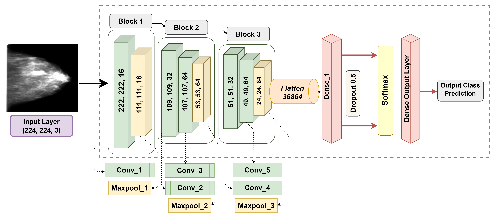

# Mammo-Light: A lightweight convolutional neural network for diagnosing breast cancer from mammography images

📚 This repository contains the original implementation of ammo-Light for classifying breast cancer from mammography Images.


## Paper

📄 This code implements the paper published in a Q1 Journal, Biomedical Signal Processing and Control, with an impact factor of 5.1.

**Title**: [Mammo-Light: A lightweight convolutional neural network for diagnosing breast cancer from mammography images](https://www.sciencedirect.com/science/article/pii/S1746809424003379)

**Authors**: Mohaimenul Azam Khan Raiaan, Nur Mohammad Fahad, Md Saddam Hossain Mukta, Swakkhar Shatabda

**Year**: 2024


## Dataset Availability

This project uses the following datasets for Diabetic Retinopathy Images:

- [CBIS-DDSM](https://www.cancerimagingarchive.net/collection/cbis-ddsm/)
- [Mammographic Image Analysis Society (MIAS) database v1.21](https://www.repository.cam.ac.uk/items/b6a97f0c-3b9b-40ad-8f18-3d121eef1459)


## Code

You can find the implementation of Mammo-Light in the following file:

- [Mammo-Light.ipynb](Models/Mammo-Light.ipynb)

## Model Architecture




📧 **Contact**: For inquiries, you can reach out to us at m.raiaan.cs@gmail.com.

**This code is shared for research use only. If you encounter any issues in this code, please feel free to contact us.**


## Citation Request

If you find this work helpful for your research, please consider citing our paper:
- **Cite:**
```bibtex
@article{raiaan2024mammo,
  title={Mammo-Light: A lightweight convolutional neural network for diagnosing breast cancer from mammography images},
  author={Raiaan, Mohaimenul Azam Khan and Fahad, Nur Mohammad and Mukta, Md Saddam Hossain and Shatabda, Swakkhar},
  journal={Biomedical Signal Processing and Control},
  volume={94},
  pages={106279},
  year={2024},
  publisher={Elsevier}
}

